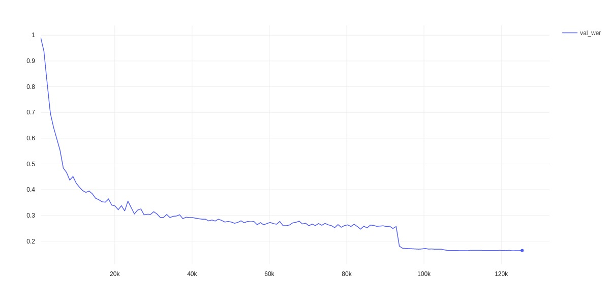
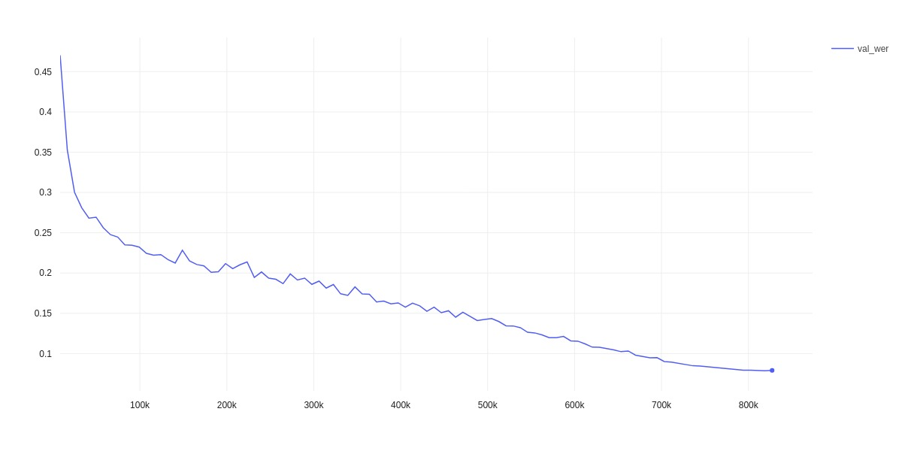
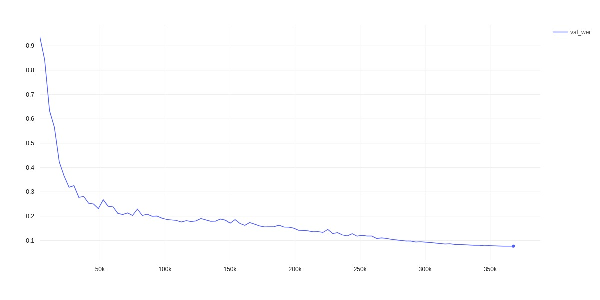

# pytorch-lighting-template
基于pytorch-lighting框架搭建的类似QuartzNet结构的语音识别模型，目前在librispeech train100 数据集上，dev-clean的WER为**16.4%**

## 快速开始
环境安装
```shell
pip install -r requirements.txt
```
如果`python -c "import torch;print(torch.cuda.is_available())"`返回False,请使用conda重新安装pytorch
```shell
conda install pytorch torchvision torchaudio cudatoolkit=11.1 -c pytorch -c nvidia
```
### 数据处理
librispeech 数据集处理
```shell
$ python scripts/get_libri.py --data_root=./data \
  --num_workers=12 --data_sets=BASE
```
+ --data_root表示存放数据集的路径
+ --num_workers 线程数
+ --data_sets 表示librispeech中的哪些部分，可选`BASE`(表示dev-clean和train-clean-100)、`ALL`（所有libir数据）或者一个子集例如`dev-clean`、`train-clean-100`进行处理

在data目录下，将会生成几个json文件，用于训练

aishell 数据集处理
```shell
python scripts/get_aishell.py --data_root=/path/to/yours/aishell/
```
### 训练
```shell
$ python train.py data.train_manifest=/path/to/you/train.json data.val_manifest=/path/to/you/val.json \
  loggers.comet.COMET_API_KEY=your-comet-key model_name=asr13×1 \
  loggers.comet.workspace=your-name
```
注意，这里的comet key需要在comet.ml网站上申请。用于在线查看实验，comet workspace为你的用户名

## 实验
### LibriSpeech train-clean-100
实验结果:
+ dev-clean: 16.4%

环境配置:
+ 2060
+ 训练时间大概5分钟一轮
+ batch size为32
+ 使用 ReduceLROnPlateau 学习率调度
+ 固定频谱裁剪分布



### LibriSpeech ALL(960h)
实验结果:
+ dev-clean: 7.9%

环境配置
+ 2060
+ 训练100轮,每轮50分钟
+ 依据长度进行按照比例频谱裁剪(如果如train-clean-100设置,loss会Nan)
+ CosineAnnealingWarmupRestarts学习率调度



### AISHELL
实验结果:
+ dev-clean: 7.6%(CER)

环境配置
+ 1060
+ 训练100轮
+ 依据长度进行按照比例频谱裁剪
+ CosineAnnealingWarmupRestarts学习率调度


